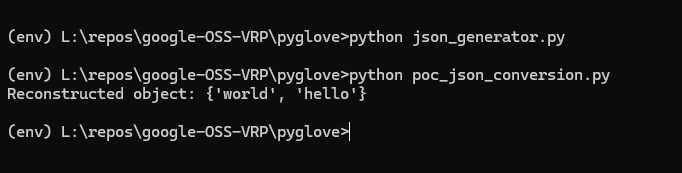
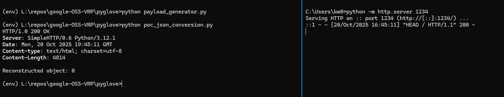
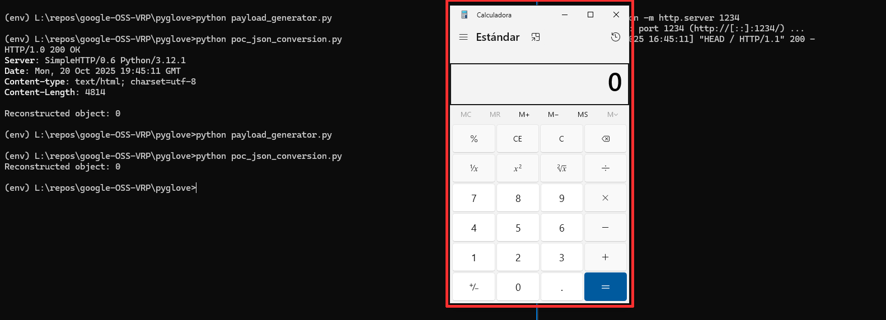
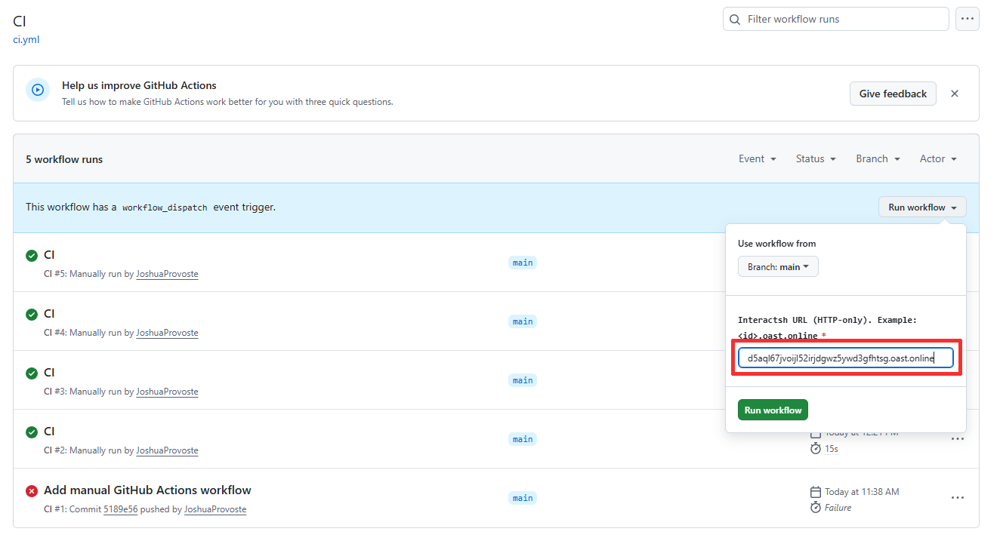
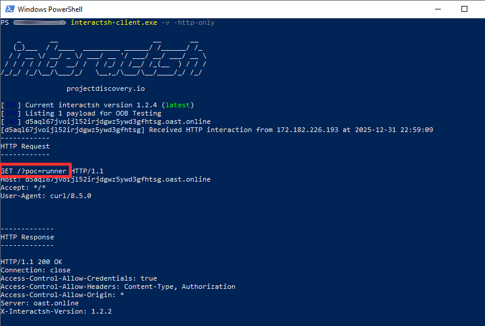
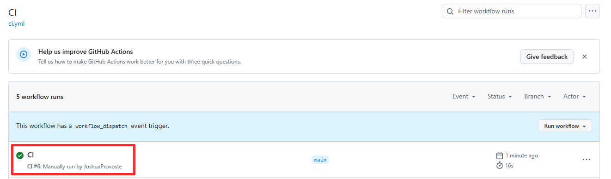

# Command Injection / Remote Code Execution (RCE) via Insecure Deserialization in decode() of json_conversion.py in PyGlove v0.4.5 - (github.com/google/pyglove)

- Author: Joshua Provoste
- Website: https://joshuaprovoste.com
- Company: https://wl-inc.cl

## Resume

`pyglove` is a Python library developed by Google that introduces the paradigm of symbolic object programming to dynamically manipulate Python programs. Its main goal is to make advanced tasks—such as AutoML, neural architecture search, runtime model patching, and logic reuse across teams or experiments—easier by representing objects as mutable, navigable structures in symbolic trees.

* https://github.com/google/pyglove
* https://pypi.org/project/pyglove/
* https://pyglove.readthedocs.io/en/latest/

## About `json_conversion.py`

This script defines an interface and utilities to convert Python objects to and from "flat" JSON representations. The base class `JSONConvertible` standardizes `to_json` and `from_json`, maintains a global type registry (`_TYPE_REGISTRY`), and marks special structures (tuples, typing annotations, functions, and methods) so they can be serialized and reconstructed. It also supports automatic type import by qualified name and lazy `_type` resolution within JSON trees.

Additionally, it includes type and function conversion (including lambdas and local functions via `marshal`), support for annotating generic types, and an "escape hatch" `_OpaqueObject` that serializes arbitrary objects using `pickle` + `base64` when no specific conversion is available. Through `resolve_typenames`, it replaces identifiers with actual factories before deserialization and exposes helpers like `registered_types`, `to_json`, and `from_json` for working with nested structures.

## The vulnerable code - L382

That line takes a `Base64` string representing an object serialized with `pickle`, decodes it to bytes (`pickle.loads(base64.decodebytes(json_value.encode('utf-8')))`), and then reconstructs the original object with `pickle.loads(...)`. It's the counterpart to encode in `_OpaqueObject`: it lets you deserialize arbitrary values that couldn't be converted to "pure" JSON.

* https://github.com/google/pyglove/blob/main/pyglove/core/utils/json_conversion.py#L382


```
  def decode(self, json_value: JSONValueType) -> Any:
    assert isinstance(json_value, str), json_value
    try:
      return pickle.loads(base64.decodebytes(json_value.encode('utf-8')))
    except Exception as e:
      raise ValueError('Cannot decode opaque object with pickle.') from e
```

The line 382 expects a `Base64` string (`str`) produced by `pickle.dumps(...)`; when it's decoded with `base64.decodebytes(...)` and passed `to pickle.loads(...)`, the original object is reconstructed. In real use, that string travels inside a JSON object of `type _OpaqueObject` under the "value" key.

Example that represents {'hola','mundo'} **as an opaque object**:

```
{
  "_type": "json_conversion._OpaqueObject",
  "value": "gASVFAAAAAAAAACPlCiMBW11bmRvlIwEaG9sYZSQLg==\n"
}
```

## Steps to Reproduce:

1. To demonstrate that the module can be manipulated, we will run `json_generator.py` to create a valid JSON file that `json_conversion.py` can process; afterwards, we will verify its deserialization by running `poc_json_conversion.py`.



2. Finally, to demonstrate that it's possible to execute commands on the operating system, we will run `payload_generator.py` to create a JSON file that injects commands (in this case, a curl comand and a pop a calc), and then execute `poc_json_conversion.py`.




## `poc_json_conversion.py` as realistic PoC

This script is a realistic PoC because it uses only the package's public API (`pyglove`) and faithfully reproduces the execution flow.

## A realistic PoC using Github Actions

This PoC reproduces, within **GitHub Actions**, the same execution flow described in the original report using only **PyGlove’s public API**. The workflow is executed manually (`workflow_dispatch`) and provisions a controlled environment (Ubuntu + Python 3.11), installs dependencies, and then runs a sequence of scripts that simulate a realistic production pipeline consuming JSON inputs from different sources.

First, `producer.py` generates a **benign control JSON** (`artifacts/benign.json`). Next, `payload_generator.py` generates a valid opaque JSON (`artifacts/poc.json`) by calling `pyglove.to_json()` on an object that cannot be represented as pure JSON, which forces PyGlove to internally use `_OpaqueObject` (pickle + base64) exactly as it does in real usage; additionally `payload_generator.py` using an external input (`oob_url`) passed the OOB from the workflow. Finally, `poc_json_conversion.py` sequentially consumes all JSON files present in `artifacts/` using `json_conversion.from_json()`, demonstrating that both benign and opaque inputs traverse the same deserialization path (`_OpaqueObject.decode` → `pickle.loads`) inside the CI pipeline, faithfully reproducing the behavior reported in a realistic and automated scenario (RCE).





## About the Impact:

Technically, that line performs `pickle.loads` on data that comes from JSON (after Base64 decoding). pickle can reconstruct arbitrary objects and execute code during deserialization (special methods like `__reduce__` or constructors can trigger instructions). If an attacker can control the JSON content —for example by injecting a Base64 string containing a malicious pickle object— then any process that calls this deserialization path may run arbitrary code: from executing OS commands to importing modules and opening network sockets. In a CI/CD environment this is especially critical because build runners and agents often have access to repositories, credentials and artifacts; malicious deserialization there can compromise the entire supply chain (implant backdoors in packages, alter or sign releases, or exfiltrate secrets).

In the context of a public PyPI package used by many projects, exploitation can scale: downstream consumers of the package who do not validate the origin of the JSON or who accept external data become exposed. If the package is used within Google Cloud environments (functions, workers, deployment agents or internal services) the risk includes escalation to service accounts, access to instance metadata, infrastructure modification, and distribution of compromised artifacts within the organization. Immediate mitigations: remove/avoid `pickle` for untrusted data, switch to safer formats (native JSON with schemas), enforce type allowlists during deserialization, sign/verify the provenance of blobs, run deserialization in sandboxes or least-privilege processes, and audit or pin package versions in CI/CD pipelines.

## Supporting Material/References:

### About `pickle`

* https://docs.python.org/3/library/pickle.html


### About Supply Chain Attacks

This type of vulnerability is commonly exploited in the context of Software Supply Chain Attacks, where an unknown vulnerability is leveraged to poison or compromise services.

In this regard, it directly applies to the following types of Software Supply Chain Attacks:

* Software Supply Chain Compromise → when the attack modifies legitimate components in repositories, pipelines, or dependencies.
* Malicious Package Injection → when an actor directly uploads malicious code to an ecosystem such as npm, PyPI, or RubyGems.
* CI/CD Pipeline Compromise → when integration and deployment systems are manipulated to insert malicious code into the build process.

For example, this has been observed in well-known cases such as Ultralytics / PyPI (2024–2025), Comm100 (2022), GitHub Actions attack on "tj-actions / changed-files" and "reviewdog / action-setup" (2025), and the GitHub Actions Supply Chain Attack (2025, widespread).

* https://www.crowdstrike.com/en-us/blog/new-supply-chain-attack-leverages-comm100-chat-installer/
* https://www.reversinglabs.com/blog/compromised-ultralytics-pypi-package-delivers-crypto-coinminer
* https://unit42.paloaltonetworks.com/github-actions-supply-chain-attack/

### About the disclosure

This report was authorized for full release by the Google Bug Hunter Team.